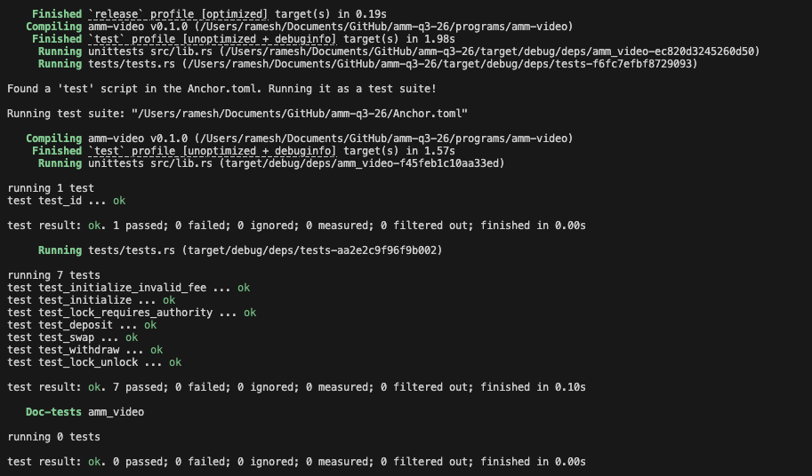

# AMM — Constant Product Market Maker

A constant product (x·y = k) AMM built with [Anchor](https://www.anchor-lang.com/). Anyone can spin up a pool for a pair of SPL mints, provide liquidity for LP tokens, and swap against the pool. Swaps pay two fees: an LP fee that stays in the pool and a protocol fee that accrues to program-owned treasury accounts. An optional pool authority can lock/unlock the pool.

Program ID (localnet): `FuUSR4aaifTyejvPqhPYjmRHE54bL3AWbqFEGbmvGqBk`

Curve math comes from [constant-product-curve](https://github.com/deanmlittle/constant-product-curve).

## Architecture

One `Config` PDA per pool (keyed by an arbitrary `seed`), which owns every pool asset:

```
config       PDA  seeds = ["config", seed.to_le_bytes()]    (pool state)
  ├── mint_lp     PDA  seeds = ["lp", config]               (LP mint, authority = config)
  ├── vault_x     ATA  (mint_x, owner = config)             (pool reserves)
  ├── vault_y     ATA  (mint_y, owner = config)
  ├── treasury_x  PDA  seeds = ["treasury_x", config]       (protocol fees, token acct)
  └── treasury_y  PDA  seeds = ["treasury_y", config]
```

```rust
#[account]
#[derive(InitSpace)]
pub struct Config {
    pub seed: u64,                 // Distinguishes pools / configs
    pub authority: Option<Pubkey>, // Optional authority allowed to lock/unlock
    pub mint_x: Pubkey,            // Token X
    pub mint_y: Pubkey,            // Token Y
    pub fee: u16,                  // Swap fee in basis points (stays in pool for LPs)
    pub protocol_fee: u16,         // Protocol fee in basis points (sent to treasury)
    pub locked: bool,              // If the pool is locked
    pub config_bump: u8,           // Bump for the config PDA
    pub lp_bump: u8,               // Bump for the LP mint PDA
}
```

All outbound token movements (vault payouts, LP minting) are CPIs signed with the config PDA's seeds — only this program can move pool funds.

## Instructions

| Instruction  | Arguments | Description |
|--------------|-----------|-------------|
| `initialize` | `seed`, `fee`, `protocol_fee`, `authority` | Creates the pool: config, LP mint, both vaults, and both treasuries. Rejects `fee + protocol_fee >= 10_000` bps. |
| `deposit`    | `amount`, `max_x`, `max_y` | Adds liquidity. First deposit takes `max_x`/`max_y` and bootstraps the pool; later deposits take pro-rata amounts, slippage-capped by `max_x`/`max_y`. Mints `amount` LP tokens. |
| `withdraw`   | `amount`, `min_x`, `min_y` | Burns `amount` LP tokens and pays out the pro-rata share of both vaults, slippage-floored by `min_x`/`min_y`. |
| `swap`       | `is_x`, `amount_in`, `min_amount_out` | Swaps along x·y = k. The protocol fee is skimmed off `amount_in` into the input-side treasury; the remainder trades through the curve, which applies the LP fee. Fails on `min_amount_out` slippage. |
| `lock`       | — | Authority-only: blocks deposit / withdraw / swap. |
| `unlock`     | — | Authority-only: re-enables the pool. |

## Fees

- **LP fee** (`fee`, bps) — applied by the curve on swaps; value accrues to LP token holders since it stays in the vaults.
- **Protocol fee** (`protocol_fee`, bps) — taken from the swap input before it reaches the curve and transferred to the matching `treasury_x`/`treasury_y` token account (owned by the config PDA).

## Security model

- **Pool isolation by derivation** — every account is derived from the config PDA (`has_one` mints + seeds constraints), so accounts from one pool can't be mixed into another.
- **PDA-signed value transfer** — vault payouts and LP minting require the config PDA's signature, produced only by this program.
- **Lock gating** — `deposit`, `withdraw`, and `swap` all `require!(!config.locked)`; only `config.authority` may toggle it (`NoAuthoritySet` / `InvalidAuthority` otherwise).
- **Checked math** — protocol fee math uses u128 checked ops; curve errors map to typed `AmmError`s (`SlippageExceeded`, `CurveError`, ...).

## Build

```bash
anchor build
```

## Test

Tests run against [LiteSVM](https://github.com/LiteSVM/litesvm), an in-process SVM — no local validator needed. `anchor build` must run first so the tests can load the compiled `.so`.

```bash
anchor build
cargo test
```

### Test coverage

| Test | Asserts |
|------|---------|
| `test_initialize` | Config fields persisted; vaults, treasuries, and LP supply start at zero |
| `test_initialize_invalid_fee` | `fee + protocol_fee >= 10_000` bps rejected |
| `test_deposit` | Bootstrap deposit takes `max_x`/`max_y`, mints exact LP amount, debits user |
| `test_withdraw` | Burning 10% of LP supply returns exactly 10% of each vault |
| `test_swap` | Exact protocol fee lands in the treasury, vault/user balances conserve, LP supply untouched, output ≥ `min_amount_out` |
| `test_lock_unlock` | `locked` flag flips; deposit fails while locked and succeeds after unlock |
| `test_lock_requires_authority` | Non-authority signer cannot lock the pool |

### Test cli Screenshots
